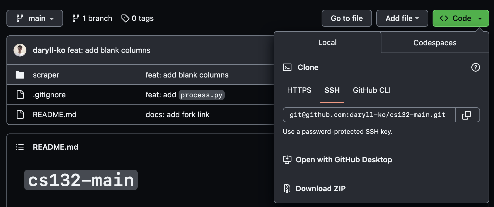

# `cs132-main`

## `scraper`

[twint user attributes](https://github.com/twintproject/twint/wiki/User-attributes) | [twint tweet attributes](https://github.com/twintproject/twint/wiki/Tweet-attributes) | [twint configuration options](https://github.com/twintproject/twint/wiki/Configuration) | [`minamotorin`'s fork](https://github.com/minamotorin/twint)

Table columns (optional ones are bracketed):

- ID
  - `09-[row number]`
- Timestamp of inclusion
- Tweet URL
- Group
  - `09`
- Collector
  - `Daryll | Westin | Zandrew`
- Category
  - `RBRD`
- Topic
  - `Leni's incompetence as VP`
- Keywords
- Account handle
- Account name
- Account bio
- Account type
- Joined
- Following
- Followers
- Location
- Tweet
- [Translated tweet]
- Tweet type
- Date posted
- [Screenshot]
- Content type
- Likes
- Replies
- Retweets
- [Quote tweets]
- [Views]
- [Rating]
- Reasoning
- [Remarks]
- Reviewer
  - leave blank
- Review
  - leave blank

### Instructions

[Group 9 **fodder** spreadsheet](https://docs.google.com/spreadsheets/d/1ASOjERZSayN9qM3yESaNbGJy8DXeeddVyxhD8jvBmcY/edit#gid=654167680) | [Group 9 **final** spreadsheet](https://docs.google.com/spreadsheets/d/1xeTTNx1zVFSfcaIIqL7B2uOQ3gnYt_L5z_ioXfwIL5Q/edit#gid=107810933)

Workflow:

1. Scrape using `scrape.py`
2. Extract CSV file using `processed.py`
3. Append contents of CSV file to fodder spreadsheet
4. Select rows in fodder spreadsheet to copy-paste to final spreadsheet

Steps:

1. Download the repository as a ZIP file:



---

2. Extract the ZIP file, and in your terminal, `cd` (change directory) to the `scraper` folder:


---

3.

a) Install `twint`:

First, clone `minamotorin`'s fork:

```bash
git clone git@github.com:minamotorin/twint.git
```

Next, `cd` into the `twint` repository:

```bash
cd twint
```

Install `twint` like so:

```bash
pip3 install . -r requirements.txt
```

b) Install `snscrape` and `pandas`:

```bash
pip3 install snscrape pandas
```

---

4. Scrape tweets using the `scrape.py` program:

```bash
python3 scrape.py [-u <username>] [-s <search query>] [-l <limit>]
```

There are three command line arguments you can pass in here:

- `-u` or `--user`: **optional**; indicates the username of the Twitter user you want to scrape tweets from here (e.g., `Official_UPD`)

- `-s` or `--search`: **required**; indicates the search terms or keywords you want to use for scraping tweets (e.g., `leni`)

  - **important**: if your search terms have spaces, add backslashes before those spaces:

```bash
python3 scrape.py -s leni\ walang\ ginawa
```

- `-l` or `--limit`: **optional**; indicates the maximum number of tweets scraped; default is 100

  - **important**: if indicated, the limit must be a multiple of **20**:

```bash
python3 scrape.py -s leni\ walang\ ambag -l 60
```

Once you execute this step, an `output.csv` file should appear in the folder you are in. There's no need to touch this file; it will be processed by `process.py`.

This step is relatively short (~1 minute or so for 200 tweets).

---

5. Process tweets using the `process.py` program:

```bash
python3 process.py [-u <program user>] [-f <first index>] [-s <search query>]
```

There are three command line arguments you can pass in here:

- `-u` or `--user`: **required**; this is one of three characters: `d` (for Daryll), `w` (for Westin), or `z` (for Zandrew), indicates who's using the `process.py` program right now

- `-f` or `--first`: **required**; to find out what number to pass into this flag, **look at last row of the fodder spreadsheet**: if the last row is $\verb|09-|X$, pass in $X+1$

- `s` or `--search`: **required**; this must be the same thing you passed as the `-s` flag into the `scrape.py` program

Example:

```bash
python3 process.py -u d -f 61 -s leni\ walang\ ambag
```

Once you execute this step, a `processed.csv` file should appear in the folder you are in. This is the file we'll import into the fodder spreadsheet!

This step is the bottleneck of our workflow (roughly ~8 minutes for 200 tweets).

---

6. Import the generated `processed.csv` file into the fodder spreadsheet. Make sure to **append to the current sheet**, and **turn off the setting that recognizes values, dates, or equations**.

The header row will still be there once you import the `csv` file: **just delete that row**.

---

7. Select rows in the fodder spreadsheet we want, copy-paste them into the final spreadsheet, then fill in the remaining required columns:

   - Account Type
   - Content Type
   - Reasoning
